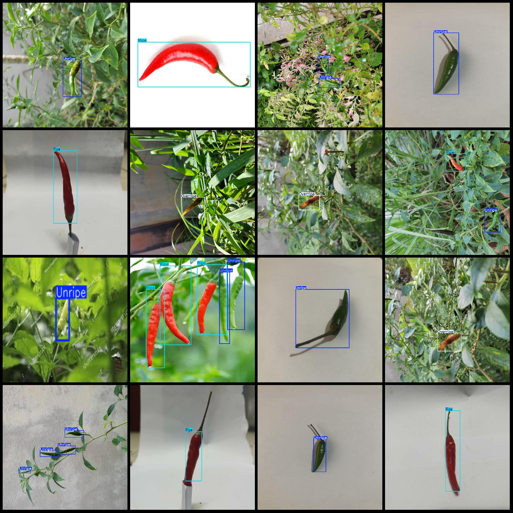
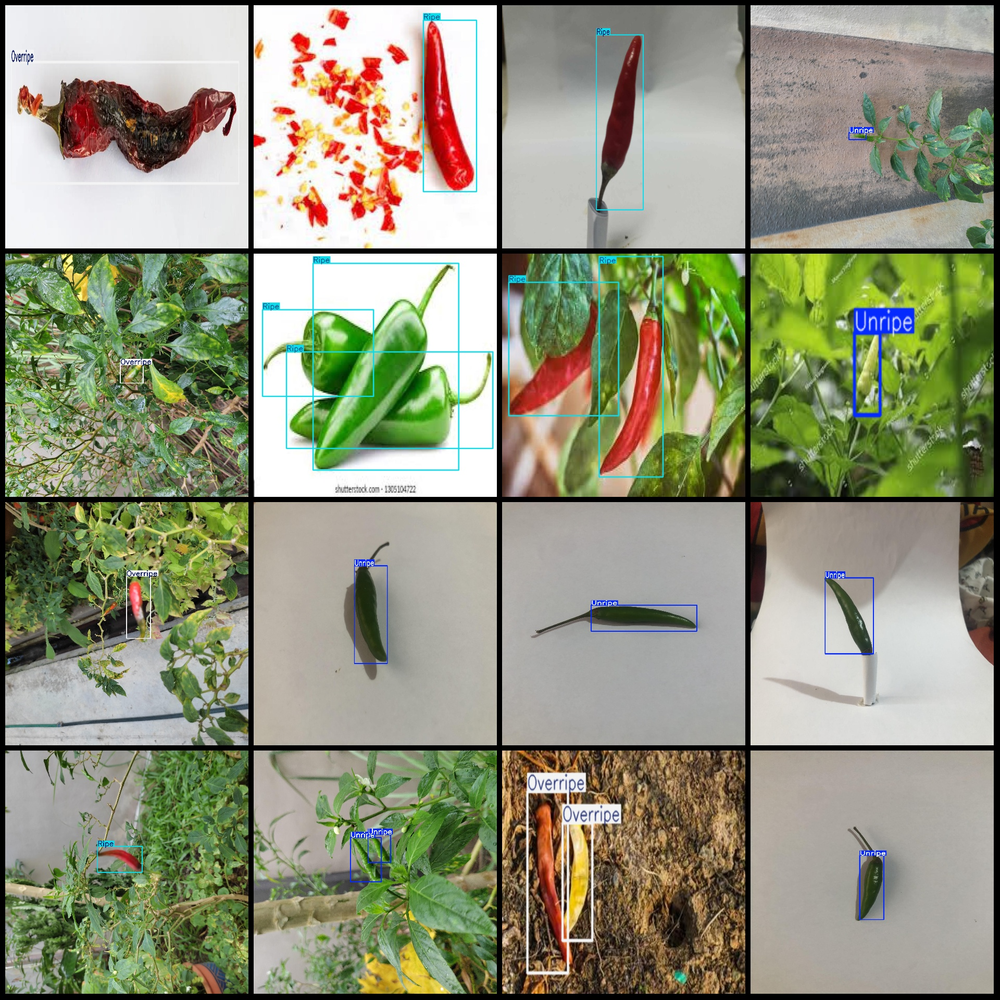

# Smart Agriculture Pepper Maturity Detection Dataset VOC+YOLO Format, 513 Images in 3 Categories

Dataset Format: Pascal VOC format + YOLO format (txt file without segmentation path, only containing jpg images, along with corresponding VOC format xml files and YOLO format txt files)
Number of Images (jpg files): 513
Number of Annotations (xml files): 513
Number of Annotations (txt files): 513
Number of Annotation Categories: 3
Annotation Category Names: ["Overripe", "Ripe", "Unripe"] (Note that the order of categories in the YOLO format is not consistent with this, but is based on the labels folder's classes.txt)
Box Count for Each Category:
- Overripe: 106 boxes
- Ripe: 416 boxes
- Unripe: 564 boxes
Total Boxes: 1086
Number of Images per Category:
- Overripe: 75 images
- Ripe: 218 images
- Unripe: 284 images
Image Resolution: Multi-resolution images, such as 2048x1536, 768x512, etc.
Used Annotation Tool: labelImg
Annotation Rules: Draw a rectangle around the category
Important Notice: The dataset does not have been divided into training, validation, or test sets; you need to divide it yourself.
Special Remark: This dataset does not guarantee the accuracy of the trained models or weight files.
Image Preview:

Annotated Example:

## Images

Here is a pay link on Stripe ( https://buy.stripe.com/3cs8yP7sY87d0vu9AB ). Please contact me lonlonago@foxmail.com after funding $89, and I will send you a complete data files , thank you!

